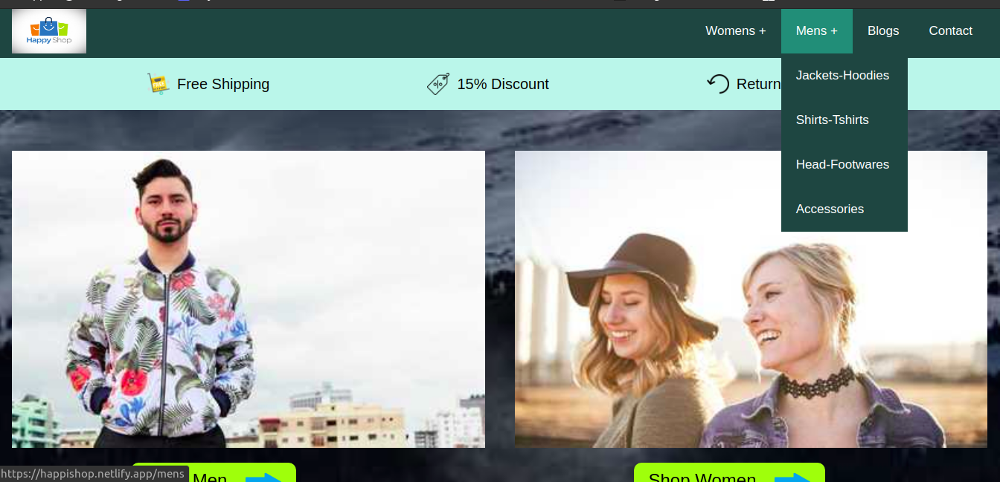

#### HappiShop for Mens and Womens Products

### How to Run :

1. Clone the Repository.
2. Go inside root of the folder and type <code>npm install</code> to download the required dependencies.
3. Run the project using <code>npm run start</code> or <code>gatsby build</code> .
4. Goto localhost:8000 to visit the Website

### View the Hosted Site

### [happishop](https://happishop.netlify.app/)

